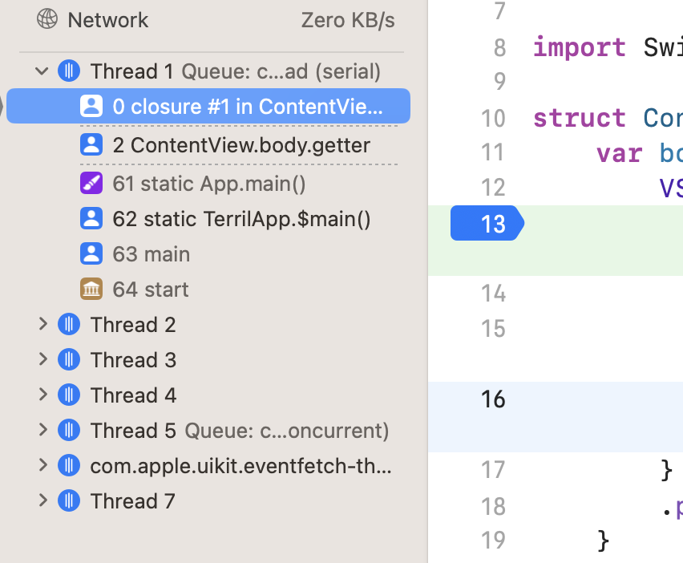

# Thread vs Queue

## Concurrence, serialisation (et parallélisme)

On dit que du code est concurrent quand on tente d'exécuter différents morceaux de code en concurrence les uns avec les autres, c'est à dire, en prenant un exemple concret :

je tente de récupérer une image et un fichier texte sur un processeur mono-coeur.

- Une approche concurrente serait de récupérer un premier bout de l'image puis un premier bout du texte, puis ensuite un autre bout de l'image, suivi d'un nouveau bout de texte et ainsi de suite. Cette approche, quand elle est effectuée très rapidement et correctement, donne l'impression à l'utilisateur que nous traitons deux taches en même temps, "en parallèle".

- une approche sérielle serait de récupérer en premier lieu l'image, puis dans un second temps le texte. Dans ce cadre, l'utilisateur constate que nous traitons une tâche après l'autre sans aucun parallèlisme.

Cependant, avec l'arrivée des multi-coeurs, il est désormais possible de faire réellement du parallélisme : je peux charger une image sur un coeur en parallèle d'un texte sur un autre coeur.

Dans le cadre du multi-coeur, il semble donc évident que la notion de concurrence devient un gain en terme d'exécution puisqu'elle est optimisée pour le parallélisme (si nous sérialisons un multi-coeur, nous perdons l'intérêt du multi-coeur qui est construit par défaut pour faire du parallélisme !).

*Attention, la concurrence n'est pas le parallélisme. La concurrence se référe à la structure de votre code, le parallélisme se réfère à l'éxécution de votre code. Vous pouvez faire de la concurrence sur du mono-coeur, mais pas du parallélisme...*

Sur le papier, la concurrence est donc beaucoup plus chouette que la sérialisation. On notera toutefois qu'avec la concurrence nous pouvons lire une donnée pendant que cette dernière est écrite, ce qui est impossible avec la sérialisation.

*Un exemple de la vie courante : les caisses au supermarché. Vous êtes deux acheteurs partageant le même compte bancaire et vous passez à la caisse : Dans le système multi-caisses, votre co-acheteur peut passer en même temps que vous à une autre caisse, vider le compte bancaire au même moment que vous et entre le moment de lire votre solde et de payer générer un bug...*

## Thread

Un thread est un contexte dans lequel est exécuté du code. Dans le cadre de Swift, on connait généralement toustes le "main thread", qui est le contexte principal qui permet à l'app de se lancer et de s'exécuter. Cependant, une app peut se lancer sur différents threads si elle le souhaite. En général, le.la développeur.euse ne choisit pas les threads sur lesquels il.elle souhaite travailler (C'est possible via NSThread, mais ce n'est pas recommandé).

On utilise GCD (Grand Central Dispatch) pour faciliter la gestion de ces threads. GCD utilise la notion de queue (Dispatch Queue).

## Queue

Une queue est une sorte de pipeline d'exécution de code. La notion de queue est très compliquée à séparer de la notion de thread (en tout cas pour moi). Mais pour tenter de donner une explication : une queue est un outil pratique pour permettre de gérer correctement la notion de concurrence et c'est l'outil recommandé par Apple (à la place du thread).

Si je devais donner une métaphore :

Vous êtes (encore) dans un supermarché. Vous arrivez à la caisse pour payer. Tout le système de caisse est un thread en soi sur lequel on exécute des bouts d'opérations pour vérifier vos achats, calculer le montant de vos achats, envoyer le paiement au système comptable, vous répartir sur les différents comptoirs, etc. Ce thread peut être découpé (ou relié à) en différents threads le cas échéant.

Une queue serait, dans ce cadre, par exemple, la gestion de la file d'attente avant la répartition aux caisses (queue sérialisée), ou encore le comptoir (queue sérialisée elle aussi). On pourrait imaginer que le système d'envoi du cash par tube serait aussi une queue mais concurrente (quoique si deux caissier.ères envoient un tube en même temps, on risque un blocage : une race condition typique des queues conccurentes).

### Main thread, main queue

Pour terminer sur ce sujet (et renforcer la métaphore précédente) : le main thread est le thread sur lequel s'effectue l'exécution principale de votre app. La main queue est une queue qui se trouve obligatoirement sur le main thread (et sur laquelle on fait généralement du travail de UI), cependant, vous pouvez être sur le main thread, mais pas forcément sur la main queue. En gros, le main thread peut "accepter" d'autres queues que la main queue :-).

## Conclusion

La limite entre thread et queue n'est pas si nette (en tout cas dans mon esprit). Pour la suite de cette présentation, nous nous attacherons donc à parler de concurrency dans le cadre de queues qui sont exécuter sur des threads gérés par les APIs délivrées par Swift/Apple. Je n'approfondirai pas GCD par ailleurs (d'une part parce que je ne suis pas assez fort sur le sujet et d'autre part parce que le but de cette présentation est de montrer comment Apple nous propose des outils pour nous protéger des problèmes de concurrency sans devoir forcément être un spécialiste des threads/queues mais tout en sachant "presque" ce qu'on est en train de faire).

https://en.wikipedia.org/wiki/Queue_(abstract_data_type)

https://en.wikipedia.org/wiki/Thread_(computing)