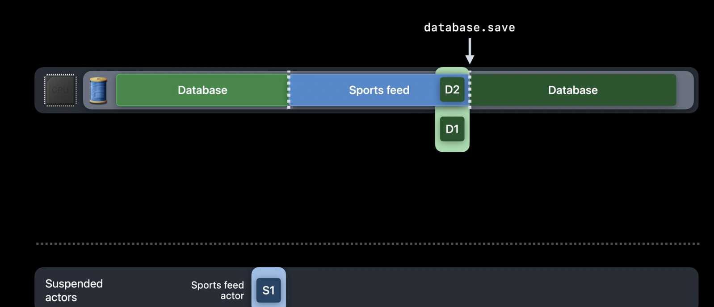
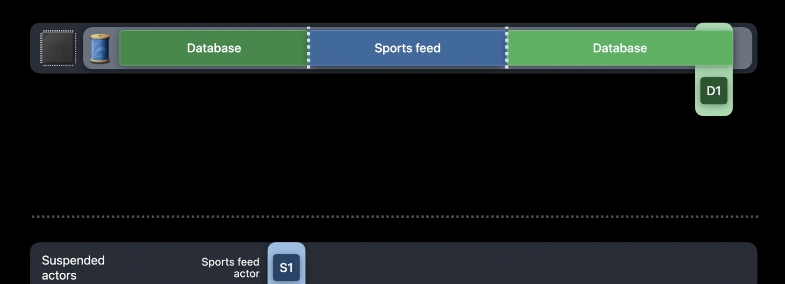

# Actor et isolation

## Definition

Un `actor` est une nouvelle forme d'entité (comparable à `struct`, `class`, `enum` par exemple).

On l'utilise donc de la manière suivante :

```swift
actor ChickenFeeder {
    let food = "worms"
    var numberOfEatingChickens: Int = 0
}
```
*source : https://www.avanderlee.com/swift/actors*

La notion provient du principe d'actor model (https://en.wikipedia.org/wiki/Actor_model).

Le concept principal est qu'un `actor` protège son état de toute forme de race conditions (on appelle ça `actor isolation`). On ne peut accéder à son état que de manière asynchrone et dans un périmètre protégé, sauf pour certaines parties du code qu'on indiquera spécifiquement comme non protégées. En principe, toutes les données mutables ne sont accessibles que dans des conditions de sécurité en terme de data races.

Les `actor`, à l'instar des `class`, sont des types passés par référence (contrairement aux `struct` passés par copie). Toutefois, ils sont très différents des `class`. En effet, outre la protection contre les data races, ils n'implémentent pas l'héritage (donc pas d'override, convenience init, open ou final !).

## Avant les `actor`

Avant les `actor`, pour protéger des data de toute forme de race condition, il existait différents moyens, soit en utilisant des sémaphores, des flags, des locks, sur des Dispatchqueue, en utilisant GCD en profondeur. En résumé, le code était plutôt compliqué.

Exemple : 

```swift
struct Document: Identifiable {
    var id: UUID
}

class DocumentStorage {
    let name: String
    private var documents = [Document.ID: Document]()
    private let queue = DispatchQueue(label: "DocumentStorage.sync")

    func store(_ document: Document) {
        queue.sync {
            self.documents[document.id] = document
        }
    }

    func document(withID id: Document.ID) -> Document? {
        queue.sync {
            self.documents[id]
        }
    }
}

```

## Avec les `actor`

Avec l'arrivée de la notion d'`actor`, on peut désormais écrire ceci :

```swift
actor DocumentStorage {
    let name: String
    private var documents = [Document.ID: Document]()
    func store(_ document: Document) {
        documents[document.id] = document
    }

    func document(withID id: Document.ID) -> Document? {
        documents[id]
    }
}
```

Bien plus simple à écrire et plus direct à comprendre. Cependant, pour l'utiliser, il faut désormais utiliser la concurrency. Ceci ne marche pas :

```swift
let storage = DocumentStorage("bibliothèque")
storage.store(Document(id: UUID()))  // Expression is 'async' but is not marked with 'await'
```

Il faudra écrire ceci :

```swift
await storage.store(Document(id: UUID()))
```

Ce code ne peut s'exécuter que dans un cadre async :-).

Par contre, on peut écrire ceci :

```swift
print(storage.name)
```

C'est assez facile à comprendre : `name` est immutable, donc on peut le lire en sync, par contre `store` fait muter l'actor, il est donc async.

**remarque :**

```swift
let document = Document(id: UUID())
await storage.store(document)
await storage.document(withID: document.id)
```

On peut écrire le code précédent, mais on constate qu'il y a deux points de suspension possible. Il serait plus optimal de faire :

```swift
extension DocumentStorage {
    func storeAndRead(_ document: Document) -> Document? {
        store(document)
        return self.document(withID: document.id)
    }
}
await storage.storeAndRead(document)
```

## Race conditions vs Exceptions

En utilisant des `actor` on retire les risques de race conditions, mais pas le risque de comportements non prédictibles.

Exemple :

```swift
let document = Document(id: UUID())
queueOne.async {
    await storage.store(document)
}
queueTwo.async {
    await storage.document(withID: document.id)
}
```

Si queueOne accède au storage en premier, alors queueTwo va récupérer un document non nil, sinon, elle récupérera un document nil :-). Avant, nous aurions pu avoir une belle exception difficile à reproduire par ailleurs...

## `Actor` hopping

Swift concurrency gère la façon dont les `Actors` se parlent entre eux en utilisant le concept d'`Actor hopping`.

Exemple :

Supposons 3 `Actor` : un `Actor` responsable de la DataBase (appelons le `DBAct`) et deux `Actor`, l'un responsable d'aller chercher les contrats d'assurance (appelons le `InsuranceAct`) et l'autre les comptes bancaires (appelons le `BankAccountAct`).
L'utilisateur lance une requête de mise à jour.

`InsuranceAct` lance sa requête sur le thread 1. `BankAccountAct` lance sa requête sur le thread 2.

`InsuranceAct` termine sa requête et réveille `DBAct` pour lancer une sauvegarde. `DBAct` monte sur le thread 1 et `InsuranceAct` est actuellement suspendu (en attendant que `DBAct` termine sa sauvegarde).

Quelques nano-secondes plus tard, `BankAccountAct` termine sa requête et appelle `DBAct` pour lancer une sauvegarde. Cependant, `DBAct` est en cours d'utilisation sur le thread 1. `BankAccountAct` va donc être suspendu (libérant le thread 2) en attendant que `DBAct` termine son travail sur le thread 1 (ce travail peut être suspendu au besoin par autre chose qui serait jugé plus prioritaire).

`DBAct` termine son travail sur le thread 1 en rapport avec la demande de `InsuranceAct`. En premier lieu, on réveille `InsuranceAct` (qui était suspendu) pour lui annoncer que la sauvegarde est terminée (ceci peut se faire sur le thread 1 ou pas). Il y a alors un switch (un sautillement) de `DBAct` vers le travail en attente lié à `BankAccountAct`. Le thread 2 (ou pas) va reprendre `DBAct`, terminer l'opération de sauvegarde, endormir `DBAct` si il n'y a plus besoin de lui et réveiller `BankAccountAct` (qui était suspendu) pour lui dire que l'opération de sauvegarde est terminée.

Ce principe de suspension/activation et transfert entre `Actor` est appelé `Actor hopping` (l'`Actor` "sautille" d'un état à l'autre).

Attention au `Main Actor` hopping qui peut être délétère pour la qualité de votre app sur l'utilisateur (trop de `MainActor` hopping peut rendre la UI très saccadée).

Exemple :

```swift
// An example piece of data we can show in our UI
struct User: Identifiable {
    let id: Int
}

// An actor that handles serial access to a database
actor Database {
    func loadUser(id: Int) -> User {
        // complex work to load a user from the database
        // happens here; we'll just send back an example
        User(id: id)
    }
}

// An observable object that handles updating our UI
@MainActor
class DataModel: ObservableObject {
    @Published var users = [User]()
    var database = Database()

    // Load all our users, updating the UI as each one
    // is successfully fetched
    func loadUsers() async {
        for i in 1...100 {
            let user = await database.loadUser(id: i)
            users.append(user)
        }
    }
}

// A SwiftUI view showing all the users in our data model
struct ContentView: View {
    @StateObject var model = DataModel()

    var body: some View {
        List(model.users) { user in
            Text("User \(user.id)")
        }
        .task {
            await model.loadUsers()
        }
    }
}
```
*source : https://www.hackingwithswift.com/quick-start/concurrency/what-is-actor-hopping-and-how-can-it-cause-problems*
Ici, on va "hopper" entre le `MainActor` et le `Database Actor`, cependant, `MainActor` n'est pas optimisé par le `cooperative thread pool`, ce qui peut/va générer des problèmes de performance...

Pour les résoudre, il faut mettre en place des systèmes qui évitent le "hopping" (des batchs par exemple).

```swift
actor Database {
    func loadUsers(ids: [Int]) -> [User] {
        // complex work to load users from the database
        // happens here; we'll just send back examples
        ids.map { User(id: $0) }
    }
}

@MainActor
class DataModel: ObservableObject {
    @Published var users = [User]()
    var database = Database()

    func loadUsers() async {
        let ids = Array(1...100)

        // Load all users in one hop
        let newUsers = await database.loadUsers(ids: ids)

        // Now back on the main actor, update the UI
        users.append(contentsOf: newUsers)
    }
}
```

## `Actor Reentrancy` et priorétisation

Dans le cadre du `Actor hopping`, on voit bien que la priorisation (ou priorétisation bref, la notion de priorité) est essentielle. En général, les actions de l'utilisateur passent devant les actions en background (voir la priorité dans une `Task`).

### priorétisation

Supposons qu'un `Actor` reçoive des demandes avec des priorités différentes. Pour l'explication, les demandes A et B sont prioritaires sur les demandes 1, 2 et 3.

Notre `Actor` reçoit les demandes comme suit : A, 1, 2 B, 3. Il va d'abord les réorganiser comme suit : A, B, 1, 2, 3 (puisque B est prioritaire sur 1 et 2).

### `Actor` Reentrancy

Toutefois, la demande A peut être suspendue au moment de recevoir la demande B et la demande B peut-être lancée avant la demande A même si cette dernière a été présentée après (contrairement à GCD sur une queue serialisée !). Ce comportement s'appelle le principe de `Actor Reentrancy`. On peut "re"rentrer dans une tâche d'un `Actor` après que ce dernier ait été modifié par une autre tâche ! Il n'y a pas de First In First Out (c'est le contrat de non blocage du thread qui impose ça :-)).





Le problème de la reentrancy est assez complexe à gérer dans le cadre du caching... voir : https://www.youtube.com/watch?v=HqjqwW12wpw

### `Actor` isolation, Executor

Je ne ferai pas un paragraphe sur ce principe d'`Executor` (on pourrait en faire tout un livre je pense), mais l'isolation d'un `Actor` est lié au fait qu'il dispose d'un `Executor` spécifique sérialisé qui permet l'isolation de chaque accès à cet `Actor`. Voir : https://swiftrocks.com/how-async-await-works-internally-in-swift

