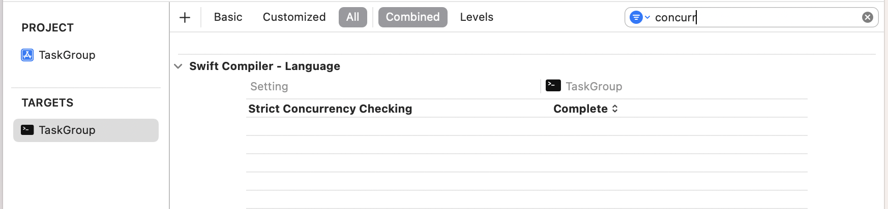

# Swift 6


## Warning 
```swift
class UIManager {
    func updateUI() { }

    func makeSomethingOnUI() {
        DispatchQueue.main.async {
            self.updateUI() \\ /!\ Capture of 'self' with non-sendable type 'UIManager' in a `@Sendable` closure
        }
    }
}
```

le warning : `Capture of 'self' with non-sendable type 'UIManager' in a `@Sendable` closure` sera considéré comme une erreur avec Swift 6 !.

Oui, oui, le truc qu'on trouve dans toutes les apps sur la planète srea interdit en Swift 6. :-). Apple a renforcé le fait que `async` nécessite du `Sendable`.

*Spoiler : il peut être remplacé par `asyncUnsafe`*, mais son usage devrait vous alerter... En théorie vous devriez lui ajouter ceci :

```swift
func makeSomethingOnUI() {
    DispatchQueue.main.asyncUnsafe {
        MainActor.assumeIsolated {
            self.updateUI()
        }
    }
}
```

Mais uniquement compatible iOS 17 et macOS 14... :-(

Voir : https://github.com/mattmassicotte/MainOffender (pour avoir quelques outils pour transitionner vers Swift 6)

Dans Xcode, il est désormais conseillé de changer ce paramètre (le plus rapidement possible) :




Ceci afin de commencer à comprendre où sont les problèmes (certains problèmes vont d'ailleurs venir des API Apple elles-mêmes).

Un exemple de problème :

```swift

protocol Store {
    var value: Int { get set}
}

class MyStore: Store {
    var value: Int = 10
}
```

Jusque là aucun problème. Toutefois, vous fixez vos warning et vous faites ce changement :

```swift
@MainActor
class MyStore: Store {
    var value: Int = 10 // /!\ Main actor-isolated property 'value' cannot be used to satisfy nonisolated protocol requirement
}
```

Oups. Deux options : 

- option 1 :

```swift
@MainActor
protocol Store {
    var value: Int { get set}
}
```

Mais alors chaque structure respectant ce protocol se retrouve projetée dans le `MainActor`...

- option 2 :

```swift
@MainActor
class MyStore: Store {
    nonisolated var value: Int {
        get { 10 }
        set { 
            // do something 
        }
    }
}
```

Yep, vous avez un sérieux problème ici...


Un autre :

```swift
func greet(name: String?) {
    var greeting = "Hello!"
    if let name = name {
        greeting = "Hello, \(name)!"
    }

    Task.detached {
        print(greeting) // error: Reference to captured var 'greeting' in concurrently-executing code
    }
}
```

vous devez écrire :

```swift
func greet(name: String?) {
    let greeting: String
    if let name = name {
        greeting = "Hello, \(name)!"
    } else {
        greeting = "Hello"
    }

    Task.detached {
        print(greeting)
    }
}
```

Oui, vous devez penser immutabilité ou passage par value type. Les références c'est mal, sauf via des `Actor` !

Oui, oui, ça pique partout...

*source : https://forums.swift.org/t/actors-revisiting-nonisolated-let-with-more-implementation-usage-and-teaching-experience/47972*

