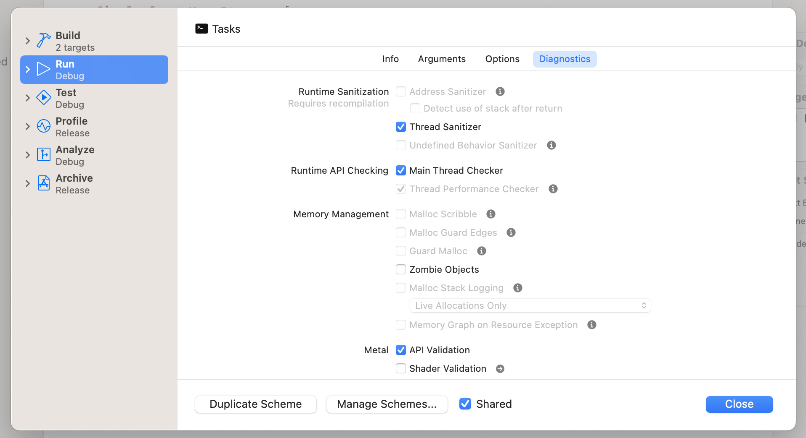

# Concurrence

## Définition

Comme nous l'avons vu précédemment, le principe de concurrence est donc d'effectuer des opérations de manière "parallèle", plus précisément, de donner des instructions et une structure au code pour qu'il puisse être exécuté de manière parallèle et accéder à des choses en même temps par des chemins différents.

### un exemple

Je suis à nouveau au supermarché avec un co-acheteur et nous effectuons nos courses de manière séparée pour aller plus vite et passer moins de temps dans ce temple du capitalisme. Pour se faire, nous utilisons une liste de courses partagée.

Notre méthode est la suivante : chacun a la même liste. Nous entrons dans le magasin par deux entrées différentes afin de ne pas parcourir les rayons ensemble (sinon nous perdons le parallélisme). A chaque produit trouvé, celui qui prend le produit dispose d'un mégaphone pour avertir son co-acheteur. Les deux acheteurs barrent le produit sur la liste et passe à un autre produit choisi au hasard ou poursuive leur recherche du dernier produit. A priori nous n'aurons aucun problème, sauf si nous décidons de rechercher le même produit en même temps. Nous risquons alors de nous retrouver devant le même produit, ou pire de trouver des produits équivalents au même moment à deux endroits différents, auquel cas nous annoncerons en même temps la prise du produit ce qui génèrera au mieux un produit en double mais au pire le rejet des deux produits et donc une sortie du supermarché sans le produit.

Cette situation est appelée une "**race condition**".

## problèmes

### Race condition (ou Race hazard)

Une race condition est assez simple à comprendre : c'est un accès à une donnée par plusieurs bouts de code en même temps.

De manière pragmatique, ça peut être :

- la modification d'une variable pendant qu'on la lit
- la modification d'une variable pendant qu'on l'efface
- la modification d'une variable pendant qu'on la modifie

Et d'autres situations imaginables.

En programmation séquentielle, ce concept n'existe pas. En programmation concurrente, c'est le plus gros risque.

https://en.wikipedia.org/wiki/Race_condition

### Deadlocks

Un deadlock est un trou sans fin dans lequel, si vous y toimbez, vous restez coincé en permanence et sans autre sortie possible qu'un crash (souvent lié à un thread explosion). Le deadlock est aussi un problème de concurrence.

https://fr.wikipedia.org/wiki/Interblocage

### Priority inversions

Dans les systèmes qui utilisent la concurrency, il existe aussi des problèmes liés à l'inversion de priorité. Dans ce contexte, une tâche à haute priorité est modifiée, bloquée, suspendue par une tâche à basse priorité. 

https://en.wikipedia.org/wiki/Priority_inversion

### Thread explosion

Le nom dit tout : le code génère une explosion du nombre de threads générés ce qui provoque une saturation du processeur.

## misc. : Foundation, Xcode

Quelques éléments spécifiques à Foundation et Xcode.

### GCD

Pour Grand Central Dispatch, GCD est une librairie en C (libdispatch) qui gère la concurrency sur iOS depuis le début. Cette lib est tout à fait géniale mais elle a été écrite par des gens qui ont présumé fortement de l'intelligence des développeur.euses, de leur capacité à ne pas générer de race conditions ou à écrire du code qui soit memory safe, en clair, la majeure partie des développeur.euses (moi y compris).

GCD est connu pour générer assez facilement des explosions de threads :-), notamment si on structure correctement ses apps pour utiliser des background dispatchqueue :-).

### Thread Sanitizer

```swift
final class NameStorage {
    private var name: String = ""
    func updateName() {
        DispatchQueue.main.async {
            self.name.append("Fred")
        }
        print(name)
    }
}
```

L'exemple ci-dessus est typique d'une race condition. Le `print` est impossible à prédire.

L'utilisation de l'option `Thread Sanitizer` dans les schemes permet de détecter de telles situations (en général, mais ça ne marche pas toujours...).



Il est aussi possible de résoudre ces problèmes avec Swift concurrency (nous le verrons plus tard dans la partie sur les `actor`).