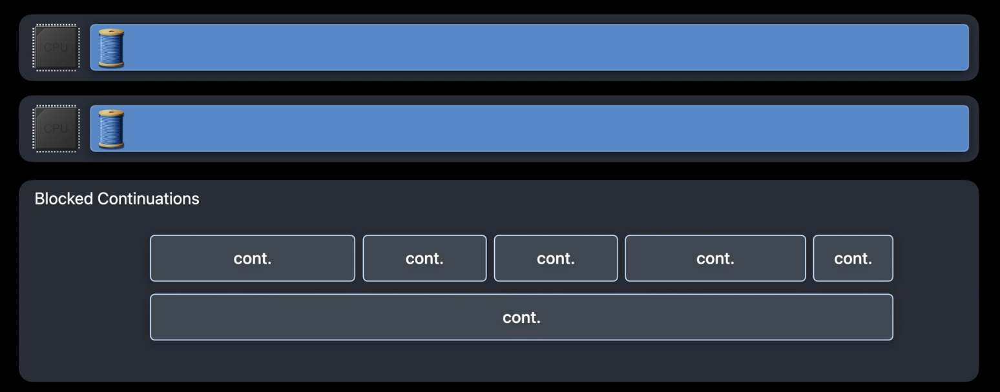

# Completion Block et structured concurrency

## Principe/Exemple

Un completion block permet de déléguer du code et récupérer un résultat de manière asynchrone.

Exemple : 

```swift
func asyncAPICall(sabotage: Bool, completion completionBlock: @escaping ((Int, Error?) -> Void)) {
    DispatchQueue.global(qos: .background).async {
        let delay = Int.random(in: 1 ... 3)
        print(" * making async call (delay of \(delay) seconds)")
        sleep(UInt32(delay))
        if sabotage {
            completionBlock(0, TestFailureCondition.anErrorExample)
        }
        completionBlock(sourceGenerator(), nil)
    }
}
```

## Problèmes

### retain cycle et thread safety

```swift
let download = URLSession.shared.dataTask(with: url) { data, response, error in
    if let error = error {
        self.handleClientError(error)
        return
    }
    // do something
}
download.resume()

```
Dans l'exemple ci-dessus, le completion block capture `self`. Il existe donc un problème de retain cycle possible. On comprend par ailleurs qu'on est dépendant du contexte d'utilisation du completion block. Le thread safety n'est donc pas assuré.

### lisibilité et structure

#### Les completion blocks ne permettent pas de lire le code de manière linéaire.

Il faut généralement sauter d'une ligne à l'autre pour comprendre l'exécution, comme dans l'exemple suivant :

```swift
let download = URLSession.shared.dataTask(with: url) { data, response, error in
    // treat execution of the task
}
download.resume()

```

On constate que le retour d'exécution du download intervient avant son exécution, ce qui rend la lecture complexe.

#### Les completions blocks génèrent des fonctions sans retour explicite (autre que dans la signature du completion block).


```swift
func asyncAPICall(sabotage: Bool, completion completionBlock: @escaping ((Int, Error?) -> Void)) {
    // do something
}
```

Ici, on doit "deviner" qu'on récupère un int.


#### Les completions blocks génèrent des doublons de traitements.

```swift
func asyncAPICall(_ completionBlock: @escaping ((Bool, Error?) -> Void)) {
    // do something
}
asyncAPICall { success, error in
	if let error = error {
		print("failde with" + error.localizedDescription)
		return
	}
	if success {
		print("succeded")
	} else {
		print("failde")
	}

}
```

Ici, on retourne une erreur en cas de problème (et potentiellement un booléen à false) et un booléen à true en cas de succès. C'est un traitement en double.

#### Les completions blocks sont source d'oubli dans les traitements (notamment avec les `guard`).

```swift
func asyncAPICall(sabotage: String?, completion completionBlock: @escaping ((Int, Error?) -> Void)) {
	guard let sabotage = sabotage else {
		return // Pas d'erreur du compilateur
	}
    // do something
}
```

Dans cet exemple, le code compile correctement, cependant, l'absence de completion dans le `else` va générer un bug pour l'utilisateur.


### Nested completion blocks : la cascade de completion

```swift
let task = URLSession.shared.dataTask(with: url) { data, response, error in
    if let error = error {
        self.handleClientError(error)
        return
    }
    guard let httpResponse = response as? HTTPURLResponse,
        (200...299).contains(httpResponse.statusCode) else {
        self.handleServerError(response)
        return
    }
    if let mimeType = httpResponse.mimeType, mimeType == "text/html",
        let data = data,
        let string = String(data: data, encoding: .utf8) {
        DispatchQueue.main.async {
            let subURL = URL(string: "https://www.example.com/" + string)!
			let subTask = URLSession.shared.dataTask(with: subURL) { data, response, error in
			    if let error = error {
			        self.handleClientError(error)
			        return
			    }
			    guard let httpResponse = response as? HTTPURLResponse,
			        (200...299).contains(httpResponse.statusCode) else {
			        self.handleServerError(response)
			        return
			    }
			    if let mimeType = httpResponse.mimeType, mimeType == "text/html",
			        let data = data,
			        let string = String(data: data, encoding: .utf8) {
			        DispatchQueue.main.async {
			            self.webView.loadHTMLString(string, baseURL: url)
			        }
			    }
			}
			subTask.resume()
        }
    }
}
task.resume()

```

Le code devient rapidement illisible en cascadant les différents résultats dans des blocks imbriqués.

## Structured Concurrency

Avant d'en parler : 

> **Swift Concurrency est un système de concurrency. Il n'est ni simple, ni facile.**

voir : https://www.youtube.com/watch?v=HqjqwW12wpw

Si vous voulez continuez alors tant pis pour vous !

La structured concurrency en Swift reprend les concepts du structured programming, tout en utilisant les principes d'asynchronisme. On conserve donc la lisibilité du code via la structuration, tout en utilisant la puissance de l'asynchronisme et de la possibilité de suspendre des exécutions sans blocage de threads.

> **Histoire de remettre l'église au milieu du village, ce concept, basé sur async/await, a été introduit en 2007 en F# et en 2012 en C# !**

Avec la structured concurrency, on résoud chacun des problèmes cités précédemment !

### retain cycle et thread safety

Avec les `Actor` nous verrons comment résoudre les problèmes de thread safety et de race conditions

### lisibilité et structure

#### Les completion blocks ne permettent pas de lire le code de manière linéaire.

En structured concurrency ce code devient :

```swift
let (data, response) = try await URLSession.shared.data(from: url)
// treat result

```

#### Les completions blocks génèrent des fonctions sans retour explicite (autre que dans la signature du completion block).

En structured concurrency ce code devient :

```swift
func asyncAPICall(sabotage: Bool) async throws -> Int {
    // do something
}
```


#### Les completions blocks génèrent des doublons de traitements.

En structured concurrency ce code devient :

```swift
func asyncAPICall() async throws -> Bool {
    // do something
}
do {
	try await asyncAPICall()
	print("succeeded")
} catch {
	print("failed with" + error.localizedDescription)
}
```

#### Les completions blocks sont source d'oubli dans les traitements (notamment avec les `guard`).

En structured concurrency ce code devient :

```swift
func asyncAPICall(sabotage: String?) async throws -> Int {
    guard let sabotage = sabotage else {
        return // Erreur du compilateur : Non-void function should return a value
    }
    // do something
}
```


### Nested completion blocks : la cascade de completion

En structured concurrency ce code devient :

```swift
let (data, response) = try await URLSession.shared.data(from: url)
guard let httpResponse = response as? HTTPURLResponse,
      httpResponse.statusCode == 200 else {
    throw WoofError.invalidServerResponse
}
guard let mimeType = httpResponse.mimeType, mimeType == "text/html",
      let data = data,
      let string = String(data: data, encoding: .utf8) else {
    throw WoofError.unsupportedData
}
let subURL = URL(string: "https://www.example.com/" + string)!
let (data, response) = try await URLSession.shared.data(from: url)
guard let httpResponse = response as? HTTPURLResponse,
      httpResponse.statusCode == 200 else {
    throw WoofError.invalidServerResponse
}
guard let mimeType = httpResponse.mimeType, mimeType == "text/html",
      let data = data,
      let string = String(data: data, encoding: .utf8) else {
    throw WoofError.unsupportedData
}
self.webView.loadHTMLString(string, baseURL: url)
```

## async tech reference

**`async/await` est basé sur GCD mais pas sur le système de DispatchQueue !**

Avec `async/await`, il n'y a plus de création de threads multiples avec les switch de contexte entre eux. Le système crée autant de thread que de coeurs disponibles sur le device sur lequel est joué votre app. Par exemple, deux threads sur une Apple watch, ou 6 sur un iphone. `async/await` utilise le principe des `continuations` au dessus du `Cooperative Thread Pool`.

On passe de ça :


à ça :




Je vous recommande vivement de regarder https://developer.apple.com/videos/play/wwdc2021/10254/.

Cette vidéo couvre en profondeur les concepts sur lesquels se basent l'implémentation de async/await en Swift.
