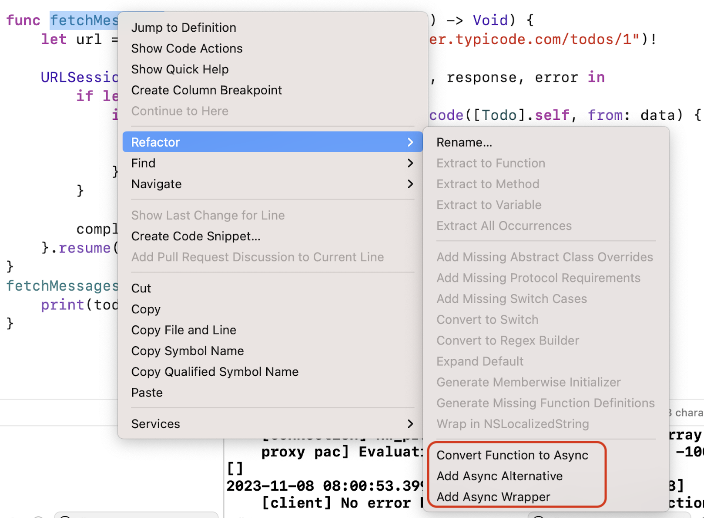

# Continuation

## Transformer un completion block en async :-)

Considérons le code suivant :

```swift
struct Todo: Decodable, Identifiable {
    let userId: Int
    let id: Int
    let title: String
    let completed: Bool
}

func fetchMessages(completion: @escaping ([Todo]) -> Void) {
    let url = URL(string: "https://jsonplaceholder.typicode.com/todos/1")!

    URLSession.shared.dataTask(with: url) { data, response, error in
        if let data = data {
            if let todos = try? JSONDecoder().decode([Todo].self, from: data) {
                completion(todos)
                return
            }
        }

        completion([])
    }.resume()
}
fetchMessages { todos in
    print(todos)
}
```

On récupère une list de todos d'une URL.

Il est possible de transformer ce code en code async en utilisant le refactor d'Xcode (pour une fois qu'il est (presque) efficace !).



Si l'on choisit le refactor en créant une alternative `async`, on obtient ceci :

```swift
@available(*, renamed: "fetchMessages()")
func fetchMessages(completion: @escaping ([Todo]) -> Void) {
    Task {
        let result = await fetchMessages()
        completion(result)
    }
}


func fetchMessages() async -> [Todo] {
    let url = URL(string: "https://jsonplaceholder.typicode.com/todos/1")!
    
    return await withCheckedContinuation { continuation in
        URLSession.shared.dataTask(with: url) { data, response, error in
            if let data = data {
                if let todos = try? JSONDecoder().decode([Todo].self, from: data) {
                    continuation.resume(returning: todos)
                    return
                }
            }
            
            continuation.resume(returning: [])
        }.resume()
    }
}
```

Le fetch donnera alors :

```swift
fetchMessages { todos in  // /!\ Consider using asynchronous alternative function
    print(todos)
}
```

On peut aussi utiliser le refacto avec un async wrapper qui donne ceci :

```swift
@available(*, renamed: "fetchMessages()")
func fetchMessages(completion: @escaping ([Todo]) -> Void) {
    let url = URL(string: "https://jsonplaceholder.typicode.com/todos/1")!

    URLSession.shared.dataTask(with: url) { data, response, error in
        if let data = data {
            if let todos = try? JSONDecoder().decode([Todo].self, from: data) {
                completion(todos)
                return
            }
        }

        completion([])
    }.resume()
}

func fetchMessages() async -> [Todo] {
    return await withCheckedContinuation { continuation in
        fetchMessages() { result in
            continuation.resume(returning: result)
        }
    }
}
```

Dans les deux cas, Xcode a donc utilisé `withCheckedContinuation`, qui permet de convertir un completion block en `async`.

La seule chose à retenir de ceci est que la `continuation` doit être `resume` **une fois et une seule**. Pas zéro ou deux ou trois : juste une fois et une seule sinon votre code sera disfonctionnel.

En conséquence de quoi ça ne vous protège pas des erreurs sur des completions blocks qui ne sont jamais appelés !

On notera que `withCheckedContinuation` peut renvoyer des erreurs :

```swift
continuation.resume(throwing: FetchError.noMessages)
```

*source : https://www.hackingwithswift.com/quick-start/concurrency/how-to-use-continuations-to-convert-completion-handlers-into-async-functions*

## Transformer un `delegate` en async

Le principe du `Delegate` peut aussi être transformé en `async` en utilisant `public struct CheckedContinuation<T, E> : Sendable where E : Error`.

Exemple :

`CLLocationManager` utilise un système de déllégation pour renvoyer les informations.

Si l'on souhaite rendre le processus async, il faut donc un moyen de conserver la `continuation` et de la renvoyer lorsqu'on reçoit le retour dans les méthodes de délégation à implémenter. (C'est le même principe avec le delegate d'une webview !).

Voici une implémentation possible (https://www.hackingwithswift.com/quick-start/concurrency/how-to-store-continuations-to-be-resumed-later)

```swift
class LocationManager: NSObject, ObservableObject, CLLocationManagerDelegate {
    var locationContinuation: CheckedContinuation<CLLocationCoordinate2D?, Error>?
    let manager = CLLocationManager()

    override init() {
        super.init()
        manager.delegate = self
    }

    func requestLocation() async throws -> CLLocationCoordinate2D? {
        try await withCheckedThrowingContinuation { continuation in
            locationContinuation = continuation
            manager.requestLocation()
        }
    }

    func locationManager(_ manager: CLLocationManager, didUpdateLocations locations: [CLLocation]) {
        locationContinuation?.resume(returning: locations.first?.coordinate)
    }

    func locationManager(_ manager: CLLocationManager, didFailWithError error: Error) {
        locationContinuation?.resume(throwing: error)
    }
}

struct ContentView: View {
    @StateObject private var locationManager = LocationManager()

    var body: some View {
        LocationButton {
            Task {
                if let location = try? await locationManager.requestLocation() {
                    print("Location: \(location)")
                } else {
                    print("Location unknown.")
                }
            }
        }
        .frame(height: 44)
        .foregroundColor(.white)
        .clipShape(Capsule())
        .padding()
    }
}
```