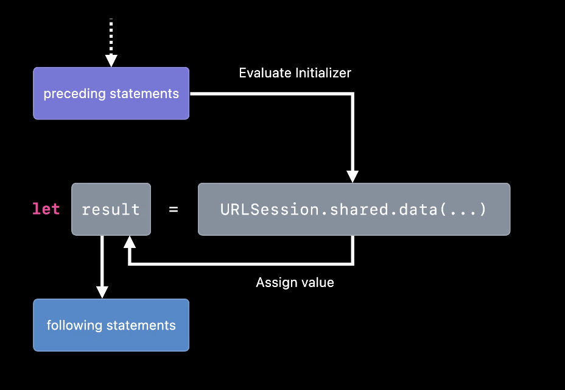
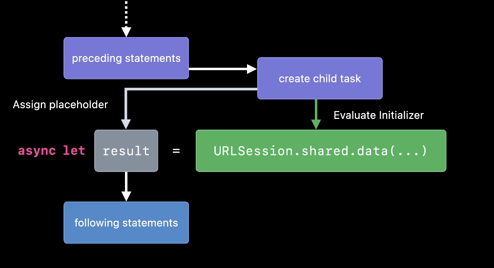
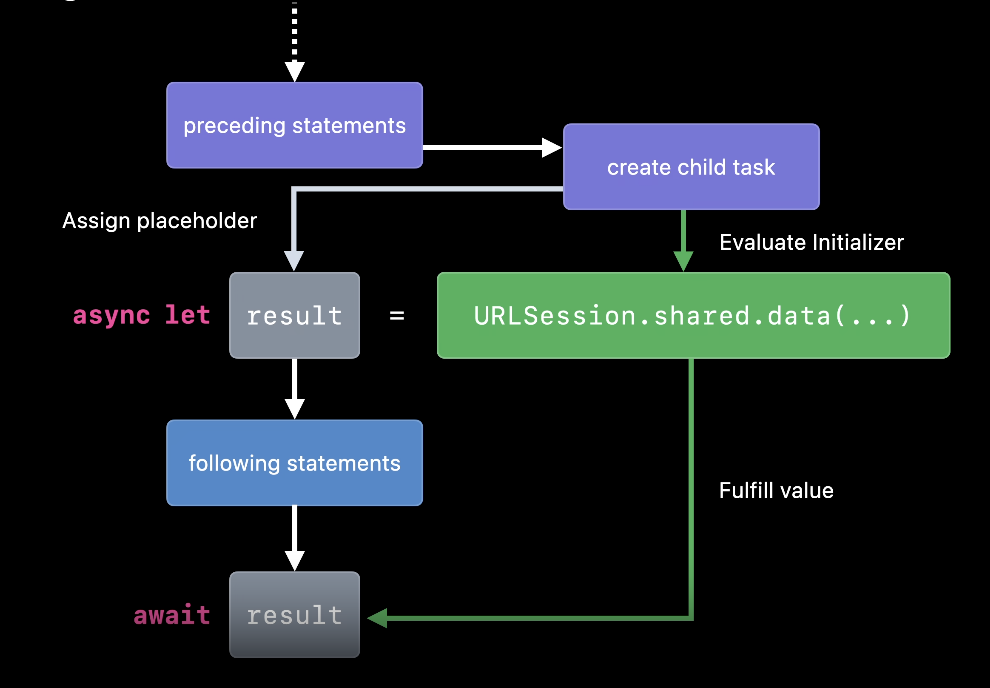

# Task

## Définition

Une `Task` est une nouvelle feature de Swift 5.5. Elle permet de créer un nouveau contexte pour exécuter du code de manière asynchrone (mais c'est le programme qui décidera au moment de l'exécution si il suspend ou pas la `Task` pour faire autre chose, ou la renvoie ailleurs.).

Exemple :

```swift
func testRandom() {
    Task {
        await asyncRandomD6()
    }
}
```

Chaque `Task` créée s'exécute en concurrence des autres contextes possiblement créés par d'autres process (une autre `Task` par exemple).

Des `Tasks` concurrentes se joueront en parallèle si le système estime que c'est efficient et surtout sécurisé de le faire. C'est donc, je répète, le système (le `Cooperative Thread Pool`) qui décidera comment jouer vos `Tasks` !

## Les types de `Task`

### async let binding

Dans l'image ci-dessous, on voit la façon dont fonctionne un let binding classique et synchrone. Le code attend le résultat de `URLSession` avant de créer le `let` result.


*Source : https://developer.apple.com/videos/play/wwdc2021/10134*

Dans l'image ci-dessous, on voit comment l'ajout du `async` devant le `let` (un async let binding) crée une `Task` (et donc un contexte spécifique) pour que l'appel à `URLSession` se fasse de manière asynchrone, sans suspendre le code.



*Source : https://developer.apple.com/videos/play/wwdc2021/10134*

Dans ce cadre, dès que vous aurez besoin de result, il faudra "attendre" l'exécution de la `Task` créée précédemment, comme le montre l'image ci-dessous.



*Source : https://developer.apple.com/videos/play/wwdc2021/10134*

`async let` crée une `Task` tout seul (une child task en fait).

### `Task` explicite

`Task` est une struct définie comme suit :

`Task<Success, Failure> : Sendable where Success : Sendable, Failure : Error`

Vous pouvez créer des `Task` de manière explicite :

```swift
Task {
    await asyncRandomD6()
}
```

Dans ce cadre, les deux types générics de task sont donc : `Success -> Never` et `Failure -> Never`

Dans ce cas, le code va créer une `Task`. Il convient de la garder si vous en avez besoin (pour la cancel par exemple).

```swift
let task = Task {
    await asyncRandomD6()
}
task.cancel()
```

Attention, une `Task` hérite de son contexte de création et ce contexte n'est pas toujours connu. On le voit bien dans l'extension qui permet de faire 'linit d'une `Task`.

```swift
extension Task where Failure == Never {
  public init(
    priority: TaskPriority? = nil,
    @_inheritActorContext @_implicitSelfCapture operation: __owned @Sendable @escaping () async -> Success
  ) {
    let flags = taskCreateFlags(
      priority: priority, isChildTask: false, copyTaskLocals: true,
      inheritContext: true, enqueueJob: true,
      addPendingGroupTaskUnconditionally: false,
      isDiscardingTask: false)

    let (task, _) = Builtin.createAsyncTask(flags, operation)
    self._task = task
  }
}
```

On notera les deux petits attributs devant le completion block `operation` : `@_inheritActorContext` et `@_implicitSelfCapture` (pour cette macro voir : **Self Capture** ci-desssous). `@_inheritActorContext` indique très clairement que l'opération hérite du contexte :-). Ainsi :

```swift
func example() async {
  Task {
    // This is NOT a parentless task, as much as it looks like one!
  }
}
```

La `Task` va hériter du contexte qui appelera `example()` puisque cette méthode est `async`... mais quand bien même :

```swift
func example() {
  Task {
    // This is NOT a parentless task, as much as it looks like one!
  }
}
@MainActor func test() {
    Task {
        example()
    }
}
```

On appelle ça `Accidental Task Inheritance` :-).

**Remarque :**

La méthode `Task.sleep(until:tolerance:clock:)` est très utile pour comprendre ce que signifie aynchrone. Elle ne fait rien d'autre que d'attendre le nombre de nano-secondes indiquées. Elle permet donc de simuler une opération de réseau par exemple :

```swift
func listPhotos(inGallery name: String) async throws -> [String] {
    try await Task.sleep(until: .now + .seconds(2), clock: .continuous)
    return ["IMG001", "IMG99", "IMG0404"]
}
```

*Source : https://docs.swift.org/swift-book/documentation/the-swift-programming-language/concurrency/*

Cependant, on notera que cette méthode est écrite uniquement pour `Task<Never, Never>`.

```swift
extension Task where Failure == Error {
    static func delayed(
        byTimeInterval delayInterval: TimeInterval,
        priority: TaskPriority? = nil,
        operation: @escaping @Sendable () async throws -> Success
    ) -> Task {
        Task(priority: priority) {
            let delay = UInt64(delayInterval * 1_000_000_000)
            try await Task<Never, Never>.sleep(nanoseconds: delay)
            return try await operation()
        }
    }
}
```

L'écriture de `Task<Never, Never>` est nécessaire afin de pouvoir trouver la méthode `sleep`, sinon le compilateur pense que `Task` se réfère à la spécialisation courante où `Failure == Error`.


#### Valeur de retour dans une `Task` (Unstructured concurrency)

Il est possible de renvoyer des valeurs dans une `Task`. En récupérant la `Task`, on peut aussi la cancel par la suite.

Comme cette `Task` n'a pas de parent, on appelle ce cadre `unstructured concurrency`.

Exemple :
```swift
let newsTask = Task { () -> [NewsItem] in
    let url = URL(string: "https://hws.dev/headlines.json")!
    let (data, _) = try await URLSession.shared.data(from: url)
    return try JSONDecoder().decode([NewsItem].self, from: data)
}
let news = try? await newsTask.value
```

#### Self Capture

```swift
class Loader {
    private func make() -> String {
        return "make"
    }
    func load() async {
        Task{
            make()
        }
    }
}
```

Dans l'exemple ci-dessus, on notera que la `Task` a capturé `self` de manière implicite. les ingénieur.euses chez Apple ont décidé qu'une `Task`, en général, s'exécute et se termine (ou est annulée) avant que celui qui l'a créée disparaisse. Si vous n'êtes pas certain, vous pouvez ajouter un `[weak self]`, malheureusement, `await` met en place une `strong reference` sur tout ce qui se trouve à sa droite... Donc, dans l'exemple ci-dessous, `self` sera quand même capturé en strong... Oui, flûte...

```swift
Task{ [weak self] in
    await self?.make()
}
```

Mais comment est-ce possible ? Les développeurs Apple ont accès à un attribut semi-public : `_implicitSelfCapture`.

Exemple :

`@_implicitSelfCapture operation: @escaping @Sendable () async throws -> Success`

`operation` va capturer `self` implicitement :-).

#### Contexte d'une `Task`

Lorsque vous créez une `Task`, vous héritez du contexte lors de la création. Par exemple, si la `Task` est sur le `MainActor` (que nous verrons plus tard), elle récupère ce contexte. Elle va aussi récupérer la priorité du contexte qui la lance.

Exemple :

```swift
Task(priority: .high) {
    Task {
        let todos = await fetchMessages()
        print(todos)
    }
}
```

la `Task` qui fetch récupère une priorité élevée.

#### priorité d'une `Task`

Dans l'exemple ci-dessous, nous avons vue que l'on pouvait définir une priorité pour une `Task`. C'est assez directe à comprendre.

Par défaut, une `Task` a une priorité de 25 (enfin c'est ce que disent les différents blogs et je leur fais confiance !).

https://www.hackingwithswift.com/quick-start/concurrency/understanding-how-priority-escalation-works

#### `Task.yield()`

On peut explicitement suspendre une `Task` en tuilisant `Task.yield()`. Certes, c'est peu courant mais c'est faisable si vous trouvez que votre code doit se suspendre de lui-même parce qu'il pourrait être trop long...

```swift
func factors(for number: Int) async -> [Int] {
    var result = [Int]()

    for check in 1...number {   
        if number.isMultiple(of: check) {
            result.append(check)
            await Task.yield()                
        }
    }

    return result
}

let factors = await factors(for: 120)
print("Found \(factors.count) factors for 120.")
```

*source: https://www.hackingwithswift.com/quick-start/concurrency/how-to-voluntarily-suspend-a-task*

#### Ordering

Attention à ceci :
```swift
func work(_ indicator: String) async {
    print(indicator)
}

Task {
    await work("first")
}

// ... du code ici

Task {
    await work("second")
}
```

Vous ne pouvez pas savoir dans quel ordre se fera le print même si dans le code "first" est écrit en premier et "second" en second... Votre seconde `Task` se jouera peut-être dans un contexte plus rapide que la première !

un moyen (Très laid !) de résoudre ce problème :

```swift
let task = Task {
    await work("first")
}
Task {
    await task.value
    await work("second")
}
```

### `task` en SwiftUI

Vous pouvez lancer du code asynchrone avec SwiftUI en utilisant le modifier `task {}` sur un composant SwiftUI.

Exemple :

```swift
List(messages) { message in
    VStack(alignment: .leading) {
        Text(message.from)
            .font(.headline)

        Text(message.text)
    }
}
.navigationTitle("Inbox")
.task {
    await loadMessages()
}
```

Attention, vous héritez du contexte (dans du `MainActor`)...

*Source : https://www.hackingwithswift.com/quick-start/concurrency/how-to-run-tasks-using-swiftuis-task-modifier*

**remarque : _inheritActorContext**

## Detached task

Une `Task` peut être "détachée" de son contexte. Elle s'exécutera aussi immédiatement mais, elle n'héritera pas de la priorité, du contexte de sa création (Notamment, elle n'héritera pas du contexte de l'`Actor` qui la crée), ni de la structure de cancel (et ça c'est plus problématique surtout si vous ne la référencez pas... Si vous ne la conservez pas, pas moyen de la cancel par la suite, elle s'exécutera seule et sans aucun controle...).

Exemple :

```swift
Task.detached {
    name = "Taylor"
}
```

Vous devrez par ailleurs capturer `self` explicitement.

On utilise les `Task.detached` dans certaines circonstances très spéciales et quand on sait ce qu'on fait. Si vous voyez une `Task.detached` dans une PR, portez-y une grande attention et posez-vous des questions sur son utilité (même - et surtout - ne faites pas confiance à un.e développeur.euse expérimenté.e... ce genre de personne a tendance à prendre des raccourcis parfois faciles... **Un.e développeur.euse expérimenté.e est un.e faineant.e en puissance.**)

**Swift prévient très clairement : il est préférable de ne pas utilisé de `Task.detached`**. Comme ça vous savez.

*source : https://www.hackingwithswift.com/quick-start/concurrency/whats-the-difference-between-a-task-and-a-detached-task*

## TaskGroup


### Création
On crée un `TaskGroup` comme ceci :

```swift
await withTaskGroup(of: Data.self) { taskGroup in
    let photoNames = await listPhotos(inGallery: "Summer Vacation")
    for name in photoNames {
        taskGroup.addTask { await downloadPhoto(named: name) }
    }
}
```

Comme son nom l'indique, il permet de regrouper des `Task` entre elles. Attention, toutes les `Task` du group doivent renvoyer le même type d'objets ! (ici: `Data.self`)

Ces `Task` sont effectuées de manière concurrente (et pas séquentielles). Elles héritent du contexte (son `Actor`) et de la priorité du `TaskGroup`.

Pour renvoyer plusieurs types d'objets, on peut les wrapper derrière un `enum` ou un `protocol`.

```swift
protocol Machin: Sendable { }

struct Machin1: Machin {
    
}

struct Machin2: Machin {
    
}
await withThrowingTaskGroup(of: Machin.self) { taskgroup -> [Machin] in
    taskgroup.addTask {
        return Machin1()
    }
    taskgroup.addTask {
        return Machin2()
    }
    var collected = [Machin]()
    do {
        for try await value in taskgroup {
            collected.append(value)
        }
    } catch {
        
    }
    return collected
}
```

Il existe aussi une version qui peut `throw` des erreurs : `withThrowingTaskGroup<ChildTaskResult, GroupResult>`.


J'adore ce bout de code :

```swift
let images = try await withThrowingTaskGroup(
  of: Data.self
  returning: [UIImage].self
) { group in
  // 2
  for index in 0..<numberOfImages {
    let url = baseURL.appendingPathComponent("image\(index).png")
    // 3
    group.addTask {
      // 4
      return try await URLSession.shared
        .data(from: url, delegate: nil)
        .0
    }
  }
  // 5
  return try await group.reduce(into: [UIImage]()) { result, data in
    if let image = UIImage(data: data) {
      result.append(image)
    }
  }
}
```

*source : https://www.kodeco.com/books/modern-concurrency-in-swift/v2.0/chapters/7-concurrent-code-with-taskgroup*


### Cancel

Un `taskGroup` se cancel de deux manières :

- explicitement en appelant `cancelAll()`
- implicitement, lorsque la `Task` qui l'a créé est annulée (principe de propagation)

On peut continuer d'ajouter des `Task` sur un groupe qui est cancel. Dans ce cas, les `Task` ajoutées sont automatiquement marquées à cancel (et réagiront comme tel).

Si vous ne voulez pas ajouter de `Task` à un groupe cancel il vous faut utiliser `addTaskUnlessCancelled(priority:body:)` à la place de `addTask(priority:body:)`.

Attention, en appelant `cancelAll()`, vous émettez simplement un cancel vers les `Task` du groupe. Ca ne les empêche pas de s'exécuter, de se terminer, sauf si vous vérifiez le cancel dans la `Task`.

Exemple :

```swift
func printMessage() async {
    let result = await withThrowingTaskGroup(of: String.self) { group -> String in
        group.addTask {
            return "Testing"
        }

        group.addTask {
            return "Group"
        }

        group.addTask {
            return "Cancellation"
        }

        group.cancelAll()
        var collected = [String]()

        do {
            for try await value in group {
                collected.append(value)
            }
        } catch {
            print(error.localizedDescription)
        }

        return collected.joined(separator: " ")
    }

    print(result)
}

await printMessage()
```

Ceci va printé toutes les `Task`, même si elles ont été toutes cancel... Ca vient du principe que vous ne choisissez pas comment les `Task` vont s'exécuter !

Si vous voulez ne rien printer, alors il faut utiliser :

```swift
group.addTask {
    try Task.checkCancellation()
    return "Testing"
}
```

Voir la partie sur `Task` cencellation.

*Source : https://developer.apple.com/documentation/swift/taskgroup*
*SOurce : https://www.hackingwithswift.com/quick-start/concurrency/how-to-cancel-a-task-group*

### next()

Lorsque vous créez un `TaskGroup` vous pouvez itérer sur les résultats des `Task` avec le `for in` mais aussi avec une méthode qui s'appelle `next()` et qui vous donne plus de granularité :

```swift
await withTaskGroup(of: String.self) { taskGroup -> String in
    taskGroup.addTask {
        ""
    }
    taskGroup.addTask {
        "Truc"
    }
    if let first = await taskGroup.next(), !first.isEmpty {
        return first
    } else {
        taskGroup.cancelAll()
        return "Oups"
    }
}
```

On récupère le premier résultat et si il est vide alors on annule tout :-) (enfin presque).

On peut aussi boucler sur le `next` :

```swift
while let first = try await group.next() {
   collected += value
}
return collected
```
