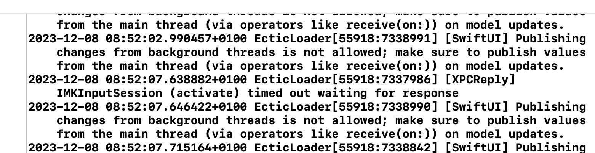
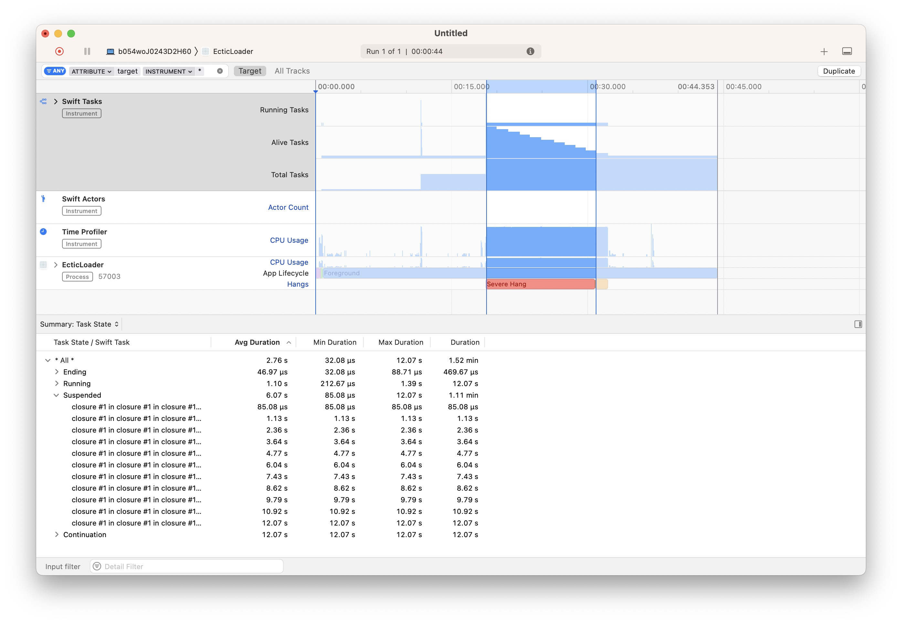
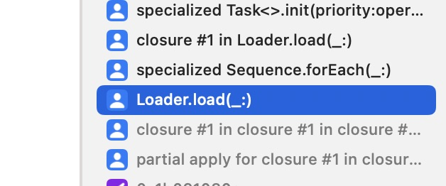
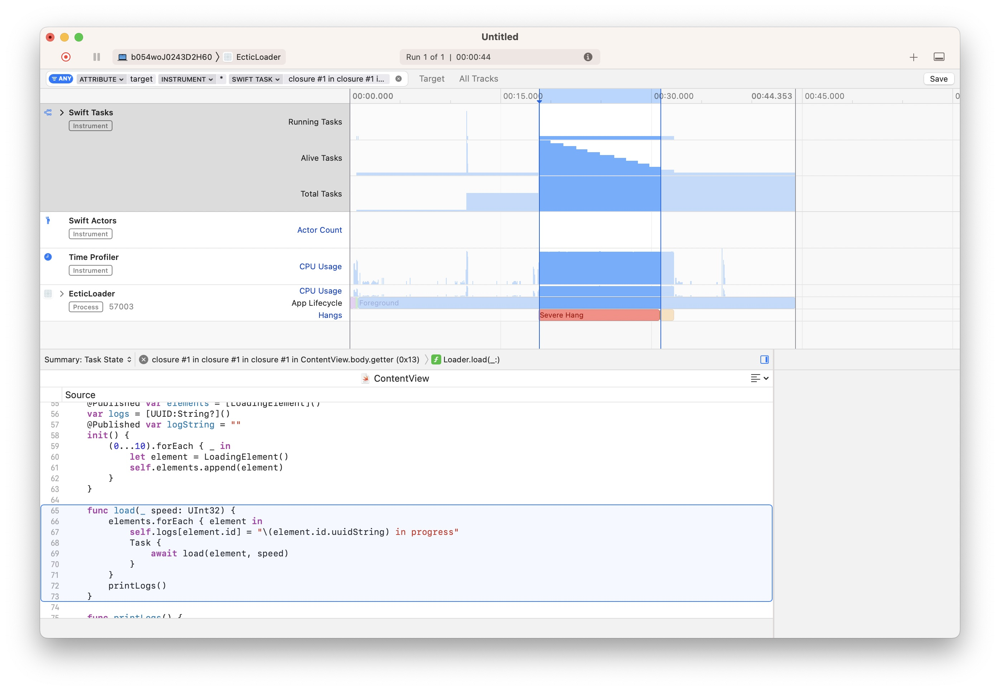

# Ectic : Phase 1 (test, débuggage et analyse)

Voici ce que donne le projet. En premier lieu, on peu cliquer sur le bouton Small Load. Les chargements se font et l'interface semblent réagir correctement.


Si on clique sur "Big load", alors la UI se freeze et l'OS nous l'indique :


Il est clair en analysant rapidement le code qu'on se trouve devant un problème de lenteur sur le main thread. La fonction synchrone :

```swift
private func load(_ element: LoadingElement, _ speed: UInt32) {
    for index in 0 ... 100 {
        StupidPackage.aStupidOperation(speed)
        element.progression = Float(index)
        if index == 100 {
            logs[element.id] = nil
            printLogs()
        }
    }
}
```

prend beaucoup trop de temps pour exécuter certaines grosses opérations.

La première étape est donc de la rendre asynchrone.

Pour se faire, on peut encapsuler l'appel de la méthode synchrone dans une `Task` unstructured :

```swift
func load(_ speed: UInt32) {
    elements.forEach { element in
        self.logs[element.id] = "\(element.id.uuidString) in progress"
        Task {
            load(element, speed)
        }
    }
    printLogs()
}
```

Le simple fait de faire ceci va envoyer le traitement de la méthode vers le Cooperative Thread Pool.

On pourrait aussi rendre la méthode synchrone, asynchrone en ajoutant async à la fin (on pourrait mettre une dispatchQueue mais nous voulons utiliser Swift concurrency !).

`private func load(_ element: LoadingElement, _ speed: UInt32) aync`

On obtient alors une erreur du compilateur dans la méthode :


Pour fixer cette erreur nous allons ajouter une `Task` unstructured dans cette méthode

```swift
func load(_ speed: UInt32) {
    elements.forEach { element in
        self.logs[element.id] = "\(element.id.uuidString) in progress"
        Task {
            load(element, speed)
        }
    }
    printLogs()
}
```

la méthode `load(element, speed)` étant `async`, il faut ajouter un `await` devant son appel (on dit clairement qu'on va attendre le résultat - et que Swift peut suspendre le calcul).


```swift
func load(_ speed: UInt32) {
    elements.forEach { element in
        self.logs[element.id] = "\(element.id.uuidString) in progress"
        Task {
            await load(element, speed)
        }
    }
    printLogs()
}
```

Désormais, nous avons une app qui compile et qui intègre de l'asynchrone pour ne pas freezer l'interface. Testons cette app.

XCode nous indique toutefois un problème : nous mettons la UI à jour depuis un thread background.




En premier lieu, il faut bien comprendre que, dés lors que vous créez une Task unstructured, vous héritez du contexte de sa création, or, ici, la classe `Loader` n'a aucun contexte spécifique. La `Task` est donc automatiquement lancée sur le Cooperative Thread Pool (c'est à dire en background) et d'ailleurs elle y reviendra par contrat (même si à un moment une partie de ce qui est effectué part sur un autre `Actor` - mais nous y reviendrons).

Pour résoudre notre problème de mise à jour de la UI en dehors du main thread nous allons marquer la classe `Loader` avec un `@Mainctor` :

```swift
@MainActor
final class Loader: ObservableObject {
	...
}
```

`@Mainctor` va renforcer le fait que les opérations, synchrones ou non, vont se dérouler sur le main `Actor`, c'est à dire sur le main thread. Nous n'aurons donc plus de souci de mise à jour de la UI depuis le background.

L'application compile. Si on la lance on voit bien que nous n'avons plus l'indication de mise à jour de la UI depuis un background. Cependant, nous retrouvons à nouveau le problème de freeze de la UI rencontré précédemment.

Pour analizer ce problème, on lance un profiling dans XCode et on choisit "Concurrency" :


Voici l'interface de Instruments en mode "Concurrency" :


Appuyez sur l'icone d'enregistrement en haut à gauche. Ceci va lancer l'app en mode recording (Instruments va enregistrer les traces de l'app). Il se peut que l'interface de l'app soit moins rapide mais c'est normal.

Dans l'app, interagissez avec le bouton "Small Load", puis avec le bouton "Big Load". Revenez sur l'interface d'Instruments et appuyez sur le bouton d'arrêt de l'enregistrement (en haut à gauche).

Voic ce que vous devriez obtenir après quelques interactions :


On voit très clairement l'"escalier" créé lors du clic sur "Big Load" (et Instruments vous indique un "Severe hang" en rouge très explicite :-)).

A cet endroit, les Tasks se sont empilées et elles ont bloquées le main thread. C'est normal, toutes les Tasks ont hérité de leur contexte d'Actor qui est le MainActor puisque la class est marquée MainActor.

Sélectionnez l'indication de "Severe hang" et cliquez droit pour afficher le menu de zoom. Choisissez "Set Inspection Range".


Instruments va focuser sur la partie problématique et n'afficher que les éléments de cette partie.


Ouvrez la partie "Suspended" (elle répertorie toutes les Tasks qui ont été suspended durant cette période d'exécution) :



Une des Tasks est restée en suspens pendant 12 secondes. Vous pouvez la sélectionner et cliquez sur la petite flèche grise.


On obtient le détail de la Task :


Dans la partie droite, on visualise la partie de code qui a lancé cette Task. On peut sélectionner cette partie de code en cliquant dessus :



On affiche alors le bout de code qui est à l'origine du problème :

