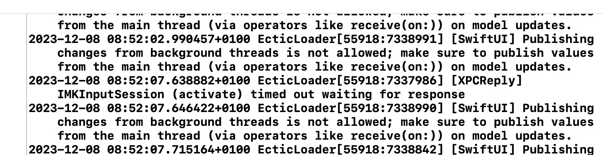
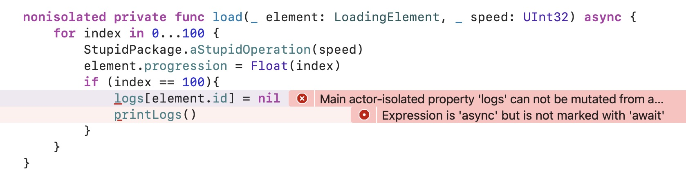
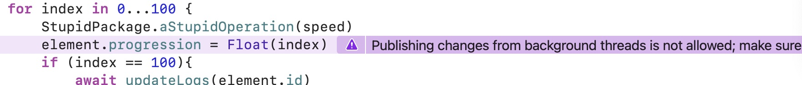
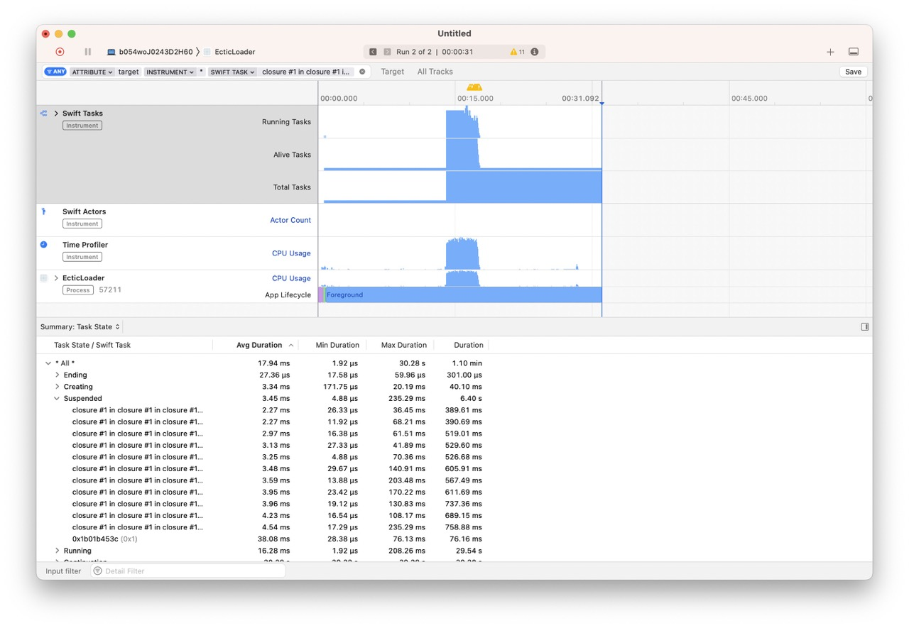
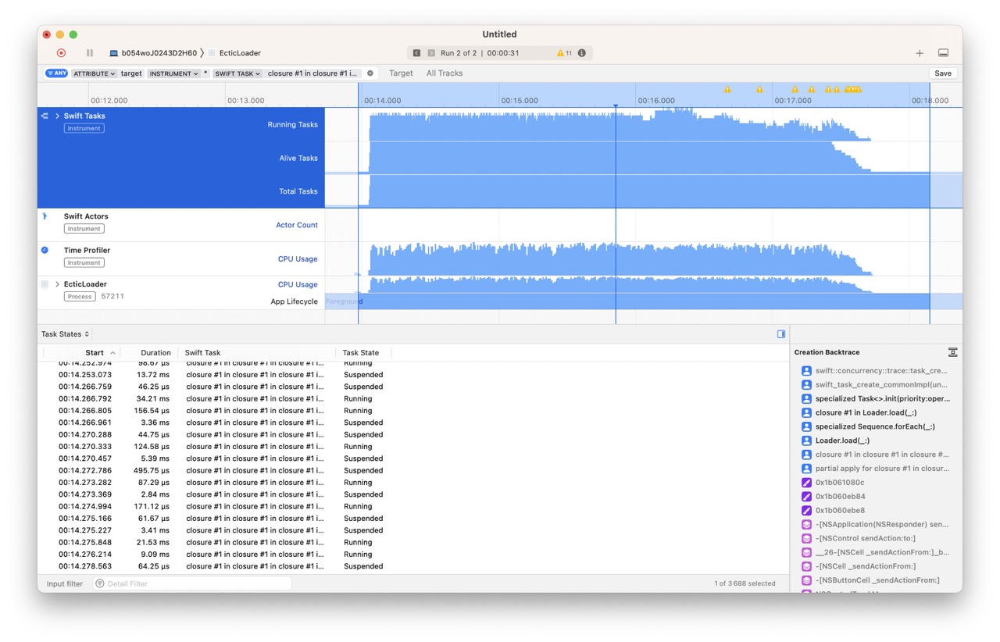
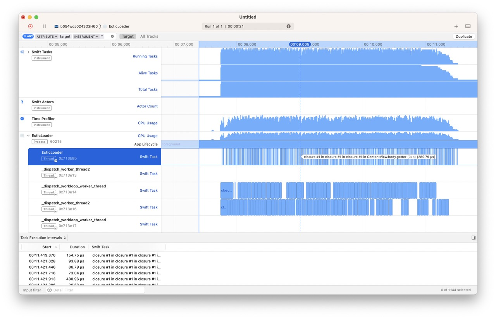
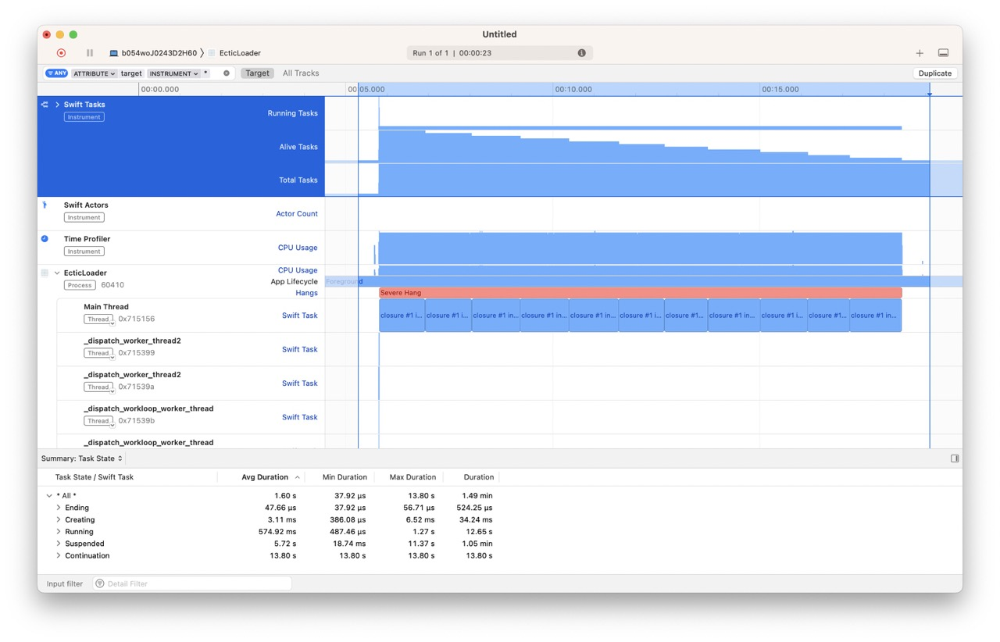

# Ectic : Phase 2 (résolutions ou pas)

## remove @MainActor

En premier lieu, on pourrait retirer le @MainActor sur la class `final class Loader: ObservableObject`.

Le problème c'est alors que vous allez `Published` des changements sur un contexte qui n'est pas le `MainActor` et d'ailleurs le debuggueur vous l'indique très clairement :



Vous mettez à jour du SwiftUI dans un contexte de `background thread`. C'est mal.

Donc retirer le `@MainActor` n'est pas la bonne pratique...

## utiliser nonisolated

On pourrait ajouter `nonisolated` sur la func : 

`nonisolated private func load(_ element: LoadingElement, _ speed: UInt32) async`

On obtient les erreurs suivantes :



La seconde erreur `Expression is 'async' but is not marked with 'await'` est facile à corriger, il suffit d'ajouter `await` devant l'appel.

`await printLogs()`

En effet, en indiquant `nonisolated`, votre `func` part sur le thread pool automatiquement, mais elle tente d'accéder à un contexte `MainActor` ce qui n'est pas possible sans le `await` (vous devez attendre que le `MainActor` traite votre demande de `printLogs`).

La première erreur `Main actor-isolated property 'logs' can not be mutated from a non-isolated context` est aussi assez claire mais plus complexe à corriger (elle nécessite plus de changements). Elle indique que vous tentez de muter une valeur d'une classe marquée `MainActor`, hors de cet `Actor` (dans un contexte non isolé). C'est impossible (sinon le concept d'Actor ne sert plus à rien...).

Pour la corriger voici une possibilité :

```swift
func updateLogs(_ id: UUID) {
    logs[id] = nil
}

nonisolated private func load(_ element: LoadingElement, _ speed: UInt32) async {
    for index in 0...100 {
        StupidPackage.aStupidOperation(speed)
        element.progression = Float(index)
        if (index == 100){
            await updateLogs(element.id)
            await printLogs()
        }
    }
}
```

Vous créez une fonction isolée `func updateLogs(_ id: UUID)` et vous l'appelez avec un `await`. De cette manière vous redonnez la main au `MainActor` pour décider quoi faire avec tout ça.

En ajoutant `nonisolated` vous lancez votre `func` dans un contexte hors du `MainActor`, contexte géré par le Thread Pool. Vous allez maintenant switcher entre le main et ce nouveau contexte (vous allez faire du hopping).

Si vous testez, votre interface ne freeze plus, vous pouvez interagir avec. Cependant, vous publiez des changements en dehors du `MainActor`, comme l'indique XCode :



Pour fixer ce problème vous pouvez demander à revenir explicitement sur le `MainActor`, un peu à la façon d'un `dispatchqueue.main.async { }` :

```swift
nonisolated private func load(_ element: LoadingElement, _ speed: UInt32) async {
    for index in 0...100 {
        StupidPackage.aStupidOperation(speed)
        await MainActor.run {
            element.progression = Float(index)
        }
        if (index == 100){
            await updateLogs(element.id)
            await printLogs()
        }
    }
}
```

Si on lance Instruments, on constate qu'il n'y a plus de "severe hangs".



En zoomant spécifiquement sur la zone correspondant au clic sur "Big Load", on constate que les `Task` sautent d'un état à l'autre (de `running` à `suspended`).



En déployant la partie de CPU Usage on constate bien la création de différents threads et le switch de contexte de l'un à l'autre.



Comparaison avec la version full `MainActor`



