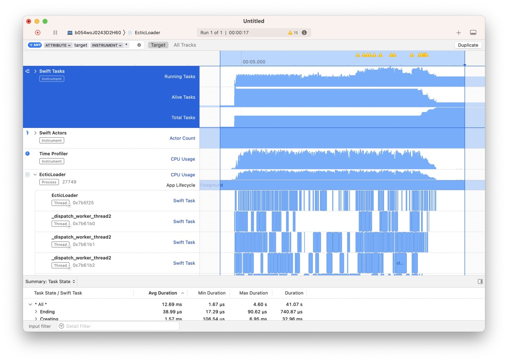
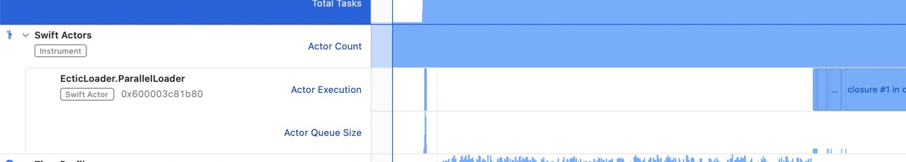
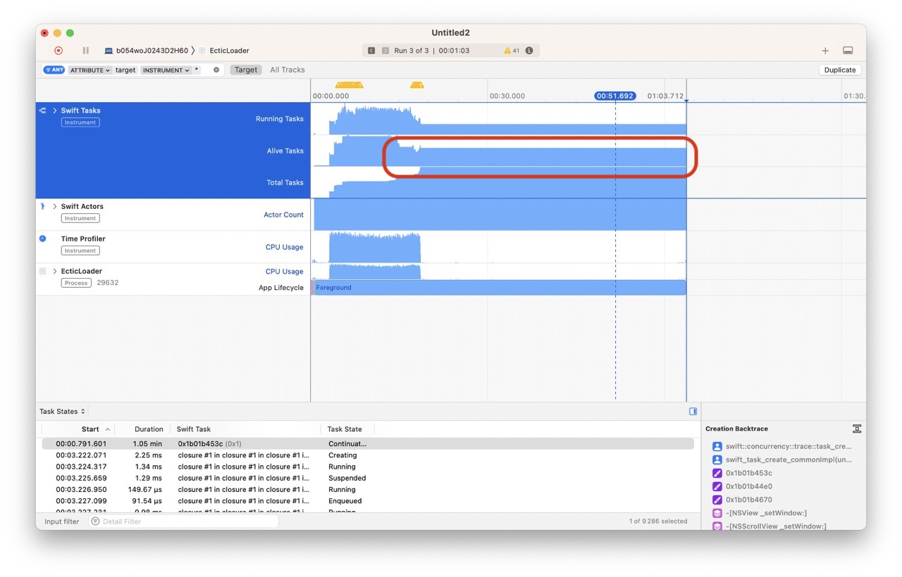

# Ectic : Phase 3 (optimisation)

Même si notre application fonctionne correctement, en termes de structure elle n'est pas véritablement découpée.

Nous pourrions mettre tout le traitement ainsi que les logs dans un `Actor` spécifique :

```swift
@MainActor
final class Loader: ObservableObject {
    @Published var elements = [LoadingElement]()
    @Published var logString = ""
    
    var parallelLoader: ParallelLoader!
    
    init() {
        self.parallelLoader = ParallelLoader(loader: self)
        ...
    }
}


actor ParallelLoader {
    var logs = [UUID: String?]()
    
    unowned let loader: Loader
        
    init(loader: Loader) {
        self.loader = loader
    }
    
    func updateLogs(_ id: UUID) {
        logs[id] = nil
    }
}
```

Il nous faut évidemment traiter différents éléments :


Ces erreurs sont classiques. Dans la première on tente de modifier une valeur hors de l'`Actor`.

Pour la résoudre on doit créer une fonction dans `ParallelLoader`.

```swift
func updateLogs(_ id: UUID, _ value: String? = nil) {
    logs[id] = nil
}
```

Dans la classe `Loader` :

```swift
func load(_ speed: UInt32) {
    elements.forEach { element in
        await self.parallelLoader.updateLogs(element.id, "\(element.id.uuidString) in progress") 
        Task {
            await load(element, speed)
        }
    }
    printLogs()
}
```

On obtient évidemment une autre erreur :


On comprend bien qu'on lance de l'asynchrone dans du synchrone.

Pour le résoudre :

```swift
func load(_ speed: UInt32) {
    elements.forEach { element in
        Task {
        	await self.parallelLoader.updateLogs(element.id, "\(element.id.uuidString) in progress") 
            await load(element, speed)
        }
    }
    printLogs()
}
```

La seconde erreur se corrige vite :

```swift
func printLogs() {
    Task {
        logString = await parallelLoader.logs.values
            .compactMap { $0 }
            .joined(separator: "-")
    }
}
```

Ouvrons Instruments pour examiner le développement.

On constate le même découpage que dans notre app précédente, ce qui est rassurant :



Cependant, maintenant on peut voir l'apparition de notre nouvel `Actor`.



Finalement, on eut aussi totalement déplacer le code de chargement vers l'`Actor` `ParallelLoader`. (voir le projet EcticLoader_3).

Il n'y a pas d'intérêt réel à décrire ce processus, chacun peut y voir un exercice à faire tout seul.

L'intérêt vient désormais de la gestion de l'annulation. En effet, pour le moment nous sommes intelligents et nous attendons la fin d'un chargement avant d'en lancer un nouveau. mais quid de l'appui sur les boutons de chargements pendant un chargement. Techniquement rien ne se passe et nous n'avons pas de crash, mais nous devons attendre la fin de chaque `Task` avant de pouvoir en lancer de nouvelles.

On a même un problème avec des `Task` qui semblent ne pas se terminer...



