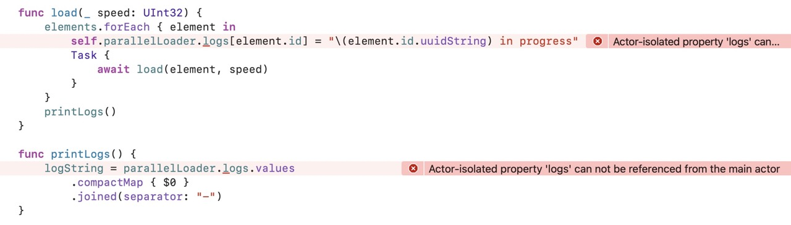
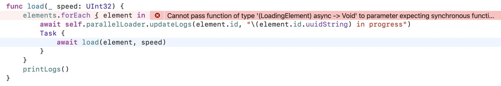

# Ectic : Phase 3 (optimisation)

Même si notre application fonctionne correctement, en termes de structure elle n'est pas véritablement découpée.

Nous pourrions mettre tout le traitement ainsi que les logs dans un `Actor` spécifique :

```swift
@MainActor
final class Loader: ObservableObject {
    @Published var elements = [LoadingElement]()
    @Published var logString = ""
    
    var parallelLoader: ParallelLoader!
    
    init() {
        self.parallelLoader = ParallelLoader(loader: self)
        ...
    }
}


actor ParallelLoader {
    var logs = [UUID: String?]()
    
    unowned let loader: Loader
        
    init(loader: Loader) {
        self.loader = loader
    }
    
    func updateLogs(_ id: UUID) {
        logs[id] = nil
    }
}
```

Il nous faut évidemment traiter différents éléments :



Ces erreurs sont classiques. Dans la première on tente de modifier une valeur hors de l'`Actor`.

Pour la résoudre on doit créer une fonction dans `ParallelLoader`.

```swift
func updateLogs(_ id: UUID, _ value: String? = nil) {
    logs[id] = nil
}
```

Dans la classe `Loader` :

```swift
func load(_ speed: UInt32) {
    elements.forEach { element in
        await self.parallelLoader.updateLogs(element.id, "\(element.id.uuidString) in progress") 
        Task {
            await load(element, speed)
        }
    }
    printLogs()
}
```

On obtient évidemment une autre erreur :



On comprends bien qu'on lance de l'asynchrone dans du synchrone.

Pour le résoudre :

```swift
func load(_ speed: UInt32) {
    elements.forEach { element in
        Task {
        	await self.parallelLoader.updateLogs(element.id, "\(element.id.uuidString) in progress") 
            await load(element, speed)
        }
    }
    printLogs()
}
```


