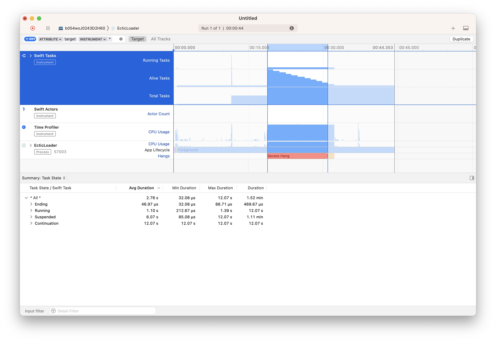

# EcticLoader

## But 

EcticLoader est un projet de test pour s'amuser avec Swift Concurrency.

Dans un premier temps, le projet est présenté tel quel et on constate qu'il y a un problème de freeze de l'interface lorsque l'on tente de lancer un "Big Load".

Nous analyserons ce freeze avec Instruments pour voir ce qui se passe.

Nous répondrons à différentes questions telles que : Pourquoi faut-il utiliser @MainActor sur la class Loader ? Pourquoi les Tasks freeze le main thread ? Comment fixer ce problème.

Dans un second temps, nous optimiserons le code pour qu'il profite du thread Pool, de la notion d'Actor, de Task.detached, de nonisolated, etc.

## Ectic : Phase 1 (test, débuggage et analyse)

Voici ce que donne le projet. En premier lieu, on peu cliquer sur le bouton Small Load. Les chargements se font et l'interface semblent réagir correctement.

Si on clique sur "Big load", alors la UI se freeze et l'OS nous l'indique :

Pour analizer ce problème, on lance un profiling dans XCode et on choisit "Concurrency" :

Voici l'interface de Instruments en mode "Concurrency" :

Appuyez sur l'icone d'enregistrement en haut à gauche. Ceci va lancer l'app en mode recording (Instruments va enregistrer les traces de l'app). Il se peut que l'interface de l'app soit moins rapide mais c'est normal.

Dans l'app, interagissez avec le bouton "Small Load", puis avec le bouton "Big Load". Revenez sur l'interface d'Instruments et appuyez sur le bouton d'arrêt de l'enregistrement (en haut à gauche).

Voic ce que vous devriez obtenir après quelques interactions :

On voit très clairement l'"escalier" créé lors du clic sur "Big Load" (et Instruments vous indique un "Severe hang" en rouge très explicite :-)).

A cet endroit, les Tasks se sont empilées et elles ont bloquées le main thread. C'est normal, toutes les Tasks ont hérité de leur contexte d'Actor qui est le MainActor puisque la class est marquée MainActor.

Sélectionnez l'indication de "Severe hang" et cliquez droit pour afficher le menu de zoom. Choisissez "Set Inspection Range".

Instruments va focuser sur la partie problématique et n'afficher que les éléments de cette partie.

Ouvrez la partie "Suspended" (elle répertorie toutes les Tasks qui ont été suspended durant cette période d'exécution) :

Une des Tasks est restée en suspens pendant 12 secondes. Vous pouvez la sélectionner et cliquez sur la petite flèche grise.

On obtient le détail de la Task :

Dans la partie droite, on visualise la partie de code qui a lancé cette Task. On peut sélectionner cette partie de code en cliquant dessus :

On affiche alors le bout de code qui est à l'origine du problème :

